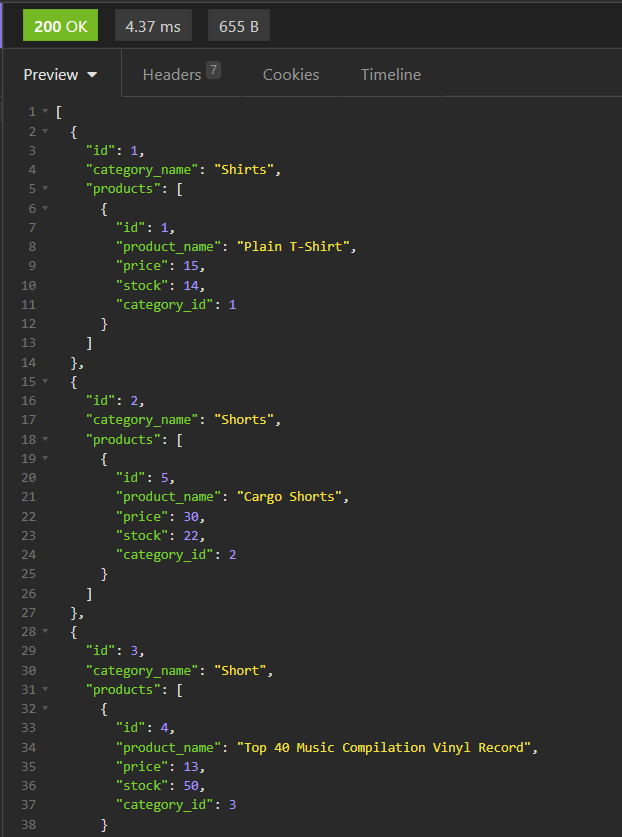

  [](https://opensource.org/licenses/MIT)
  # Backend-Retail
  ## Table of Contents
  - [Description](#description)
  - [Installation](#installation)
  - [Useage](#useage)
  - [Contribute](#contribute)
  - [Test](#test)
  - [Questions](#questions)
  - [License](#license)
  ## Description
  This program uses a mysql database. However, I utilized sequelized to manage the database. I used Insomnia to view the database results. I created routes to be able to delete, create, update and add to each of the four tables. 
  
  Here is a link to a video as I walk through the steps :
  [Youtube](https://youtu.be/VPgMYb8UEs0)

  This is a screenshot of what to expect from running the get route for categories.
  


  In this code snippet I requested all the data on products and their associated category and tags. This is done with sequelize and not mysql. 
  ```javascript
  try {
    const productData = await Product.findAll({
      include: [{ model: Category }, { model: Tag }]
    });
    res.status(200).json(productData)
  } catch (err) {
    res.status(500).json(err);
  }
  ```
  You can view the repo here:
  [Github](https://github.com/johnfrom209/Backend-Retail)

  ## Installation
  To run this program you will first need to run "npm install" to get the dependencies. Navigate to yor mysql shell and run "source schema.sql". After that go back to your text editor and run "npm run seed". This will populate the db with seeds. Lastly, you will have to run "node server.js" while inside root folder. That is all.
  ## Useage
  If you want to use this you will need insomia. After you install, view Installation section for details, and run some of the following routes: 
  * "/api/categories"
  * "/api/products"
  * "/api/tags"  
  In order to view a single item add an id at the end like so "/:id" at the end of the routes.
  ## Contribute
  NA
  ## Test
  If you want to test if this works you will need insomia. Once you have it open, navigate to the get all categories with "/api/categories". Once you have that set up send it and insomnia will return the data in the preview. Add in id at the end, like so "/api/categories/:id" to view an individual category. 
  ## Questions
  Github repo: [!johnfrom209](https://github.com/johnfrom209?tab=repositories)

  Video: [Youtube](https://youtu.be/VPgMYb8UEs0)

  linkedin: https://www.linkedin.com/in/johnfrom209/

  ## License
  The license used for this project is MIT. Get more information by checking out the repo.
